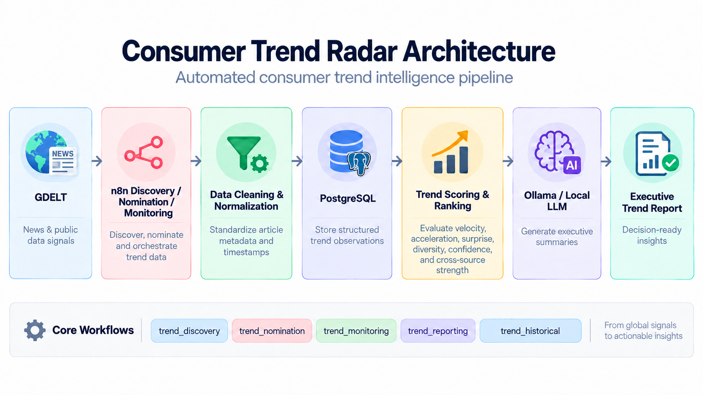

# Consumer Trend Radar

An automated consumer trend intelligence pipeline built with n8n, PostgreSQL, GDELT, Python/JavaScript processing, and a local LLM.

## System Architecture



## Project Overview

The Consumer Trend Radar was designed to reduce the manual effort required to identify, monitor, and evaluate emerging consumer trends from news and public data sources.

The system collects trend signals, processes and normalizes the data, scores trends based on multiple indicators, stores the results in PostgreSQL, and generates structured reporting for decision-making.

## Problem

Trend research can be time-consuming when analysts manually search multiple sources, compare signals, clean data, and determine which trends are actually gaining momentum.

A more scalable workflow was needed to automate data collection, trend evaluation, and reporting.

## Solution

I built an automated workflow using n8n that:

- Collects trend signals from GDELT
- Normalizes and cleans incoming article data
- Stores structured trend observations in PostgreSQL
- Calculates trend scores using velocity, acceleration, surprise, diversity, confidence, and cross-source strength
- Classifies trends into stages such as Breakout, Growing, Emerging, and Watchlist
- Ranks trends based on overall strength
- Generates executive summaries using a local LLM through Ollama
- Includes error handling for failed or empty data responses

## Automation Workflow

```text
GDELT
  ↓
n8n Data Collection
  ↓
Data Normalization
  ↓
PostgreSQL Storage
  ↓
Trend Scoring & Ranking
  ↓
Local LLM Analysis
  ↓
Executive Trend Report
